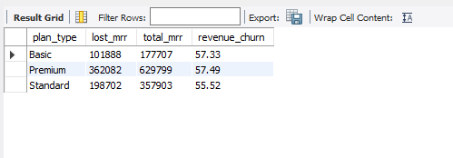
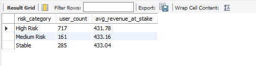

# Subscription Churn and Revenue Leakage Analysis 

## Objective 
The goal of this project was to analyze customer retention for a subscription-based service and identify the primary drivers of churn. I performed data cleaning to clear system anomalies and conducted a deep dive into revenue impact, plan performance, and user behavior.

## Project Summary
This project identifies a critical **56.8% Revenue Churn Rate** for a subscription-based service. By auditing 2,691 user records, I identified that is not driven by pricing or lack of loyalty, but by high-frictional technical reasons.

**Key Findings:** 61% of the current "active" users are currently in a "High-Risk" state due to system friction, which shows a potential future loss of **310,000 in monthly revenue**.

## Phase 1: Data Integrity and Cleaning
Before performing the analysis, I did a data audit to ensure the reliability of the metrics.
* **Anomaly Found:** 109 records (approximately 4% of the data) showed a `last_login_days_ago` occuring *before* the `signup_date`.
* **Action:** Developed a **CTE-based pipeline** to exclude the 109 rows, ensuring behavioral averages (usage, tenure) were not skewed.
* **Result:** A clean dataset of **2,691 records** used for all subsequent diagnostics.

## Phase 2: Financial Plan and Plan Performance
I calculated the **Monthly Recurring Revenue (MRR)** to quantify the business crisis.
* **Revenue Leakage:** The business loses **662,672** (Churn = Yes) compared to **502,737** retained.
* **Tier Neutrality:** Churn rates are nearly identical across all plans, which proves that the issue is not the **pricing**, but a core platform experience issue.

```
sql
WITH clean_data AS (
	SELECT * 
    FROM churn_usage
    WHERE last_login_days_ago <= DATEDIFF('2024-12-31', signup_date)
)
SELECT plan_type,
SUM(CASE WHEN churn  = 'Yes' THEN monthly_fee ELSE 0 END) AS lost_mrr,
SUM(monthly_fee) AS total_mrr,
ROUND(SUM(CASE WHEN churn = 'Yes' THEN monthly_fee ELSE 0 END) * 100.0 / SUM(monthly_fee) , 2) AS revenue_churn
FROM clean_data
GROUP BY plan_type;
```


## Phase 3: Diagnostic Phase
Comparing the users that "Stayed" vs "Left" groups revealed counter-intuitive behaviours that challenges the typical churn assumptions.
* Churned users remain highly active **(12.3 hrs/week)** until the point of exit.
* Average tenure for both groups is **18.5 months**. Long-term users are not more resilient to churn that new ones.
* Churned users averaged significantly higher **Payment Failures = 2.80** and **Support Tickets = 4.26**.

## Phase 4: Risk Identification 
I segmented the remaining **1,163 active users** to identify the "Ticking Time Bombs" in the current revenue stream.
```
sql
WITH clean_data AS (
	SELECT * 
    FROM churn_usage
    WHERE last_login_days_ago <= DATEDIFF('2024-12-31', signup_date)
)
SELECT
	CASE
		WHEN support_tickets >= 5 OR payment_failures >= 3 THEN 'High Risk'
        WHEN support_tickets BETWEEN 3 AND 4 THEN 'Medium Risk'
        ELSE 'Stable'
	END AS risk_category,
    COUNT(*) AS user_count,
    ROUND(AVG(monthly_fee), 2) AS avg_revenue_at_stake
FROM clean_data
WHERE churn = 'No'
GROUP BY 1;
```


## Business Recommendations
* **Optimize Payment Gateways:** The active group currently averages **2.07 payment failures**. Immediate optimization of the payment processor is needed to stop "accidental" churn of willing subscribers.
* **Proactive Support Intervention:** Prioritize the **717 High-Risk users** for direct outreach. Preventing the "5th ticket" breaking point could save approximately **310,000** in immediate monthly revenue.
* **Prioritize Technical Stability:** The data reveals that high engagement (13.7 hrs/week) does not prevent churn. This shows that users  want to use the app but are being driven away by bugs. The engineering team should focus on app stability and resolving core performance issues to ensure a smoother user experience.
