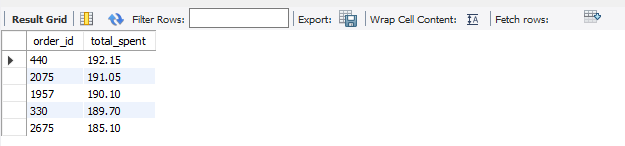

# Restaurant Order Analysis

## Objective
The goal of this project was to analyze restaurant order data to identify which menu items drive revenue and understand customer ordering patterns.

## Dataset
The dataset consists of two tables:
1. `menu_items`: Details about the dishes (menu_item_id, item_name, category, price).
2. `order_details`: Transactional Data (order_details_id, order_id, order_date, order_time, item_id)

## Analytical Questions
I wrote queries to answer:
* What is the total count and price range of menu items?
* Which cuisine (category) has the highest average price?
* What are the top 5 highest-spending orders?
* What categories are more popular among high-spenders?

## Key Insights
* **Top Cuisine:** Italian Food is the most frequent category among the highest-spending customers.
* **Order Volume:** Identified orders with over 12 items, highlighting potential group dining trends.
* **Pricing Strategy:** While the menu is diverse, the Italian category holds the highest average dish price, contributing significantly to the revenue.

## SQL Skills Applied
* **Multi-table Joins:** Merging `menu_items` and `order_details`.
* **Subqueries:** Used to calculate counts of orders with specific item volumes.
* **Aggregation & Filtering:** Using `SUM()`, `AVG()`, and `HAVING()` to isolate high-value data.

### Featured Query: Highest Revenue Orders
This query joins the menu and order tables to find the top 5 spenders.
` ` `
sql
SELECT order_id, SUM(price) AS total_spent
FROM order_details od
LEFT JOIN menu_items mi
    ON od.item_id = mi.menu_item_id
GROUP BY order_id
ORDER BY total_spent DESC 
LIMIT 5;
` ` `

## Business Recommendations
Based on the data:
* **Promote Italian Nights:** Since high-spenders love Italian food, consider a "Wine and Pasta" promotion to increase the average check size.
* **Review Low-Volume Items:** The items with `num_purchase` under 5 should be reviewed for potential removal from the menu to reduce inventory waste.
